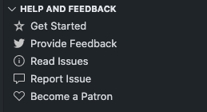

# vscode-ext-help-and-feedback-view

This module provides a **View** on any **Side Bar**, to display **Help and Feedback** links. 

The idea for this module came from the `Help and Feedback` view displayed on the **Remote Development** extensions for VS Code.

## Installation

`npm install vscode-ext-help-and-feedback-view`

## Usage

**Step 1:** Register the new view on `package.json`

```json

  "views": {
    "project-manager": [
      {
        "id": "projectManagerHelpAndFeedback",
        "name": "Help and Feedback",
        "visibility": "collapsed"
      }
    ]
```

**Step 2:** Choose between the three kinds of Items to be displayed

**Standard Links**

Use `URLs` from your `package.json`

```ts
  const standardLinksProvider = new StandardLinksProvider('alefragnani.project-manager');
  items.push(standardLinksProvider.getGetStartedLink());
```

**Custom Links**

Provide the desired `URL` yourself

```ts
  items.push({
    icon: 'heart',
    title: 'Become a Patron',
    url: 'http://patreon.com/alefragnani'
  });
```

**Commands**

Provide any registered `Command`

```ts
  items.push({
    icon: 'bell-dot',
    title: 'What\'s New',
    command: 'projectManager.whatsNew'
  })
```

**Step 3:** Instantiate the View and provide the items

```ts
  const helpAndFeebackView = new HelpAndFeedbackView(context, "projectManagerHelpAndFeedback", items);
```

## Sample

```ts
  import { HelpAndFeedbackView, 
           Link,
           Command,
           ProvideFeedbackLink,
           StandardLinksProvider } from "vscode-ext-help-and-feedback-view";

  ...

  const items = new Array<Link | Command>();

  // some standard items
  const standardLinksProvider = new StandardLinksProvider('alefragnani.project-manager');
  items.push(standardLinksProvider.getGetStartedLink());
  items.push(new ProvideFeedbackLink('projectmanager'));
  items.push(standardLinksProvider.getReviewIssuesLink());
  items.push(standardLinksProvider.getReportIssueLink());
  
  // any custom link 
  items.push({
        icon: 'heart',
        title: 'Become a Patron',
        url: 'http://patreon.com/alefragnani'
  });
  
  // creates the view
  const helpAndFeebackView = new HelpAndFeedbackView(context, "projectManagerHelpAndFeedback", items);
```

Here it is



## Support

If you find it useful, please consider supporting it.

<table align="center" width="60%" border="0">
  <tr>
    <td>
      <a title="Paypal" href="https://www.paypal.com/cgi-bin/webscr?cmd=_donations&business=EP57F3B6FXKTU&lc=US&item_name=Alessandro%20Fragnani&item_number=vscode%20extensions&currency_code=USD&bn=PP%2dDonationsBF%3abtn_donate_SM%2egif%3aNonHosted"></a>
    </td>
    <td>
      <a title="Paypal" href="https://www.paypal.com/cgi-bin/webscr?cmd=_donations&business=EP57F3B6FXKTU&lc=BR&item_name=Alessandro%20Fragnani&item_number=vscode%20extensions&currency_code=BRL&bn=PP%2dDonationsBF%3abtn_donate_SM%2egif%3aNonHosted"></a>
    </td>
    <td>
      <a title="Patreon" href="https://www.patreon.com/alefragnani"></a>
    </td>
  </tr>
</table>

# License

[MIT](LICENSE.md) &copy; Alessandro Fragnani